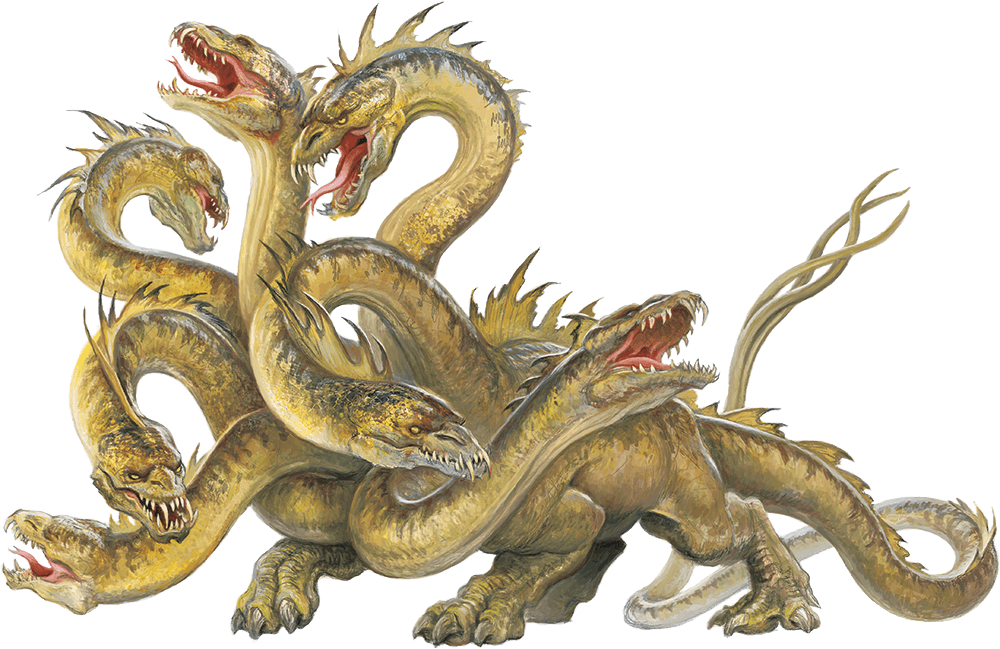

# Hydra

## Traits

* **Hold Breath.** The hydra can hold its breath for 1 hour.

* **Multiple Heads.** The hydra has five heads. While it has more than one head, the hydra has advantage on saving throws against being blinded, charmed, deafened, frightened, stunned, and knocked unconscious.

Whenever the hydra takes 25 or more damage in a single turn, one of its heads dies. If all its heads die, the hydra dies.

At the end of its turn, it grows two heads for each of its heads that died since its last turn, unless it has taken fire damage since its last turn. The hydra regains 10 hit points for each head regrown in this way.

* **Reactive Heads.** For each head the hydra has beyond one, it gets an extra reaction that can be used only for opportunity attacks.

* **Wakeful.** While the hydra sleeps, at least one of its heads is awake.

## Actions

* **Multiattack.** The hydra makes as many bite attacks as it has heads.

* **Bite.** *Melee Weapon Attack:* +8 to hit, reach 10 ft., one target.

*Hit:*10 (1d10 + 5) piercing damage.

### Description

The hydra is a reptilian horror with a crocodilian body and multiple heads on long, serpentine necks. Although its heads can be severed, the hydra magically regrows them in short order.