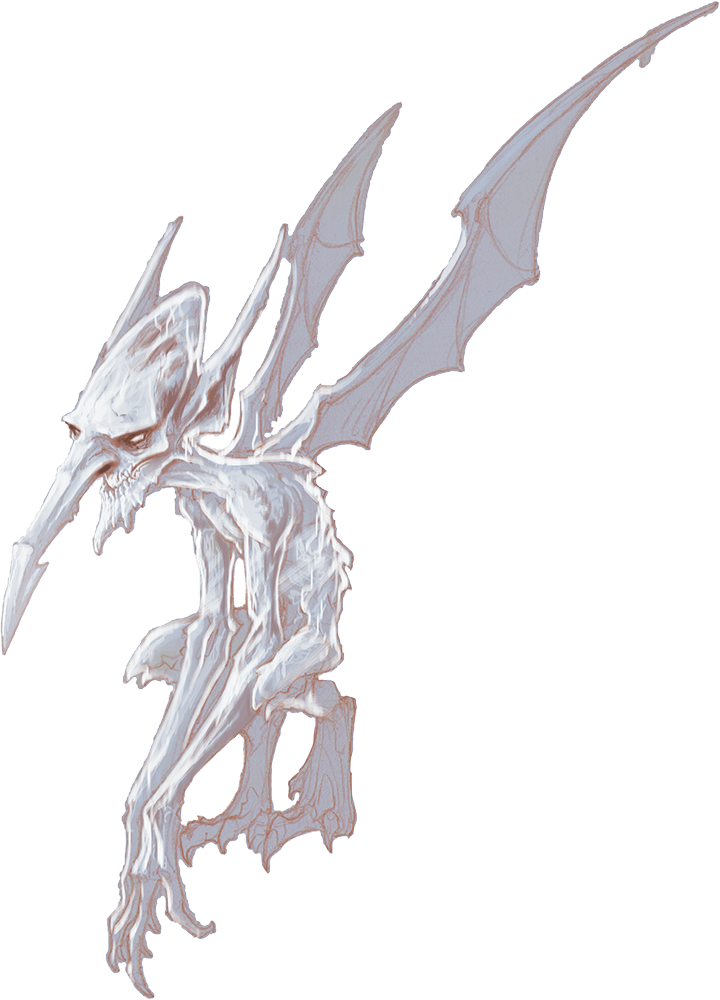

# Ice Mephit

## Traits

* **Death Burst.** When the mephit dies, it explodes in a burst of jagged ice. Each creature within 5 feet of it must make a DC 10 Dexterity saving throw, taking 4 (1d8) slashing damage on a failed save, or half as much damage on a successful one.

* **False Appearance.** While the mephit remains motionless, it is indistinguishable from an ordinary shard of ice.

* **Innate Spellcasting (1/Day).** The mephit can innately cast fog cloud, requiring no material components. Its innate spellcasting ability is Charisma.

## Actions

* **Claws.** *Melee Weapon Attack:* +3 to hit, reach 5 ft., one creature.

*Hit:*3 (1d4 + 1) slashing damage plus 2 (1d4) cold damage.

* **Frost Breath (Recharge 6).** The mephit exhales a 15- foot cone of cold air. Each creature in that area must succeed on a DC 10 Dexterity saving throw, taking 5 (2d4) cold damage on a failed save, or half as much damage on a successful one.