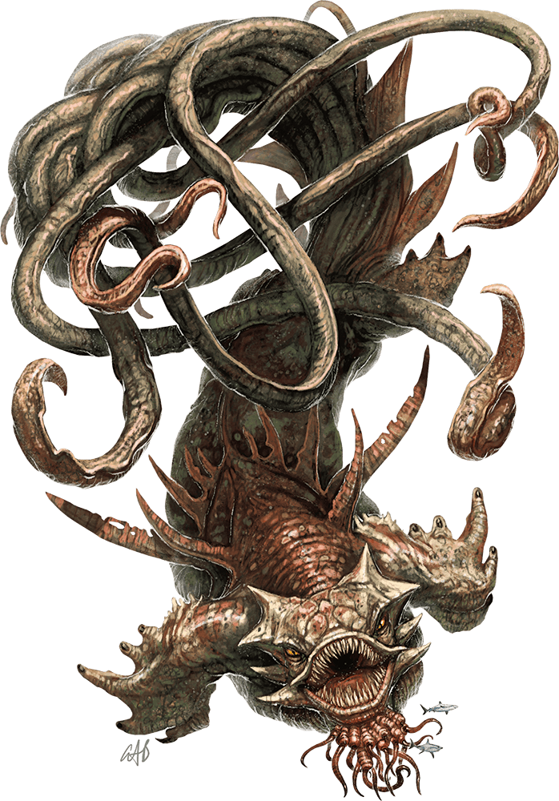

# Kraken

## Traits

* **Amphibious.** The kraken can breathe air and water.

* **Freedom of Movement.** The kraken ignores difficult terrain, and magical effects can't reduce its speed or cause it to be restrained. It can spend 5 feet of movement to escape from nonmagical restraints or being grappled.

* **Siege Monster.** The kraken deals double damage to objects and structures.

## Actions

* **Multiattack.** The kraken makes three tentacle attacks, each of which it can replace with one use of Fling.

* **Bite.** *Melee Weapon Attack:* +17 to hit, reach 5 ft., one target.

*Hit:*23 (3d8 + 10) piercing damage. If the target is a Large or smaller creature grappled by the kraken, that creature is swallowed, and the grapple ends. While swallowed, the creature is blinded and restrained, it has total cover against attacks and other effects outside the kraken, and it takes 42 (12d6) acid damage at the start of each of the kraken's turns.

If the kraken takes 50 damage or more on a single turn from a creature inside it, the kraken must succeed on a DC 25 Constitution saving throw at the end of that turn or regurgitate all swallowed creatures, which fall prone in a space within 10 feet of the kraken. If the kraken dies, a swallowed creature is no longer restrained by it and can escape from the corpse using 15 feet of movement, exiting prone.

* **Tentacle.** *Melee Weapon Attack:* +17 to hit, reach 30 ft., one target.

*Hit:*20 (3d6 + 10) bludgeoning damage, and the target is grappled (escape DC 18). Until this grapple ends, the target is restrained. The kraken has ten tentacles, each of which can grapple one target.

* **Fling.** One Large or smaller object held or creature grappled by the kraken is thrown up to 60 feet in a random direction and knocked prone. If a thrown target strikes a solid surface, the target takes 3 (1d6) bludgeoning damage for every 10 feet it was thrown. If the target is thrown at another creature, that creature must succeed on a DC 18 Dexterity saving throw or take the same damage and be knocked prone.

* **Lightning Storm.** The kraken magically creates three bolts of lightning, each of which can strike a target the kraken can see within 120 feet of it. A target must make a DC 23 Dexterity saving throw, taking 22 (4d10) lightning damage on a failed save, or half as much damage on a successful one.

## Legendary Actions

The kraken can take 3 legendary actions, choosing from the options below. Only one legendary action option can be used at a time and only at the end of another creature's turn. The kraken regains spent legendary actions at the start of its turn.

**Tentacle Attack or Fling.** The kraken makes one tentacle attack or uses its Fling.

**Lightning Storm (Costs 2 Actions).** The kraken uses Lightning Storm.

**Ink Cloud (Costs 3 Actions).** While underwater, the kraken expels an ink cloud in a 60-foot radius. The cloud spreads around corners, and that area is heavily obscured to creatures other than the kraken. Each creature other than the kraken that ends its turn there must succeed on a DC 23 Constitution saving throw, taking 16 (3d10) poison damage on a failed save, or half as much damage on a successful one. A strong current disperses the cloud, which otherwise disappears at the end of the kraken's next turn.

### A Kraken’s Lair

A kraken lives in dark depths, usually a sunken rift or a cavern filled with detritus, treasure, and wrecked ships.

#### Lair Actions

On initiative count 20 (losing initiative ties), the kraken takes a lair action to cause one of the following magical effects:

- A strong current moves through the kraken’s lair. Each creature within 60 feet of the kraken must succeed on a DC 23 Strength saving throw or be pushed up to 60 feet away from the kraken. On a success, the creature is pushed 10 feet away from the kraken.
- Creatures in the water within 60 feet of the kraken have vulnerability to lightning damage until initiative count 20 on the next round.
- The water in the kraken’s lair becomes electrically charged. All creatures within 120 feet of the kraken must succeed on a DC 23 Constitution saving throw, taking 10 (3d6) lightning damage on a failed save, or half as much damage on a successful one.

#### Regional Effects

The region containing a kraken’s lair is warped by the creature’s blasphemous presence, creating the following magical effects:

- The kraken can alter the weather at will in a 6-mile radius centered on its lair. The effect is identical to the control weather spell.
- Water elementals coalesce within 6 miles of the lair. These elementals can’t leave the water and have Intelligence and Charisma scores of 1 (−5).
- Aquatic creatures within 6 miles of the lair that have an Intelligence score of 2 or lower are charmed by the kraken and aggressive toward intruders in the area.

When the kraken dies, all of these regional effects fade immediately.