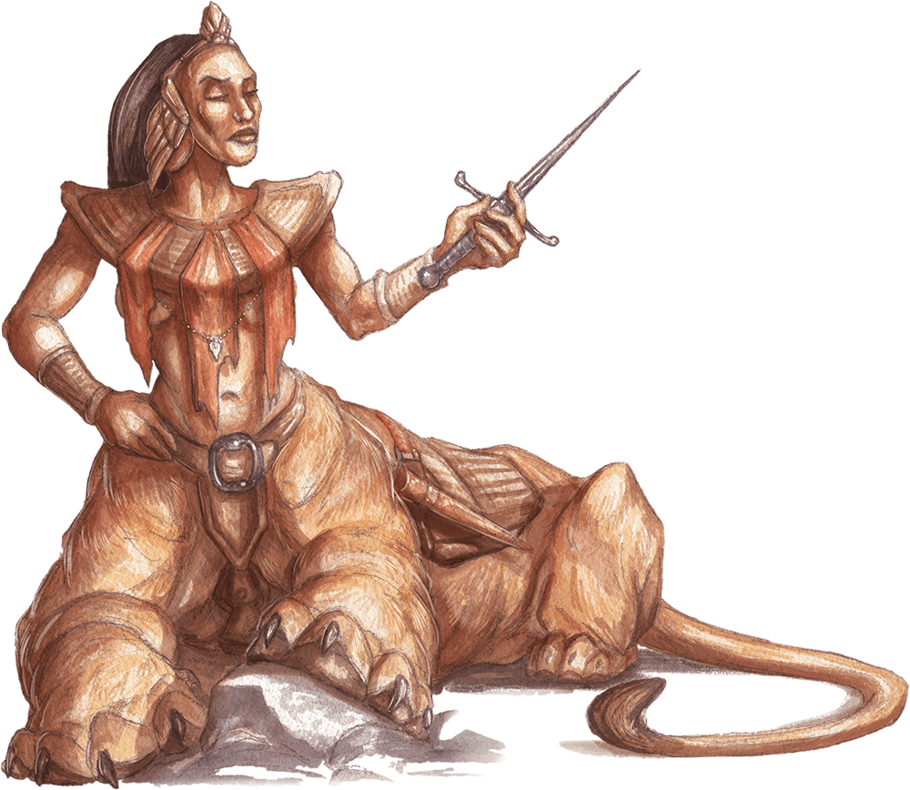

# Lamia

## Traits

* **Innate Spellcasting.** The lamia’s innate spellcasting ability is Charisma (spell save DC 13). It can innately cast the following spells, requiring no material components.

At will: disguise self (any humanoid form), major image

3/day each: charm person, mirror image, scrying, suggestion

1/day: geas

## Actions

* **Multiattack.** The lamia makes two attacks: one with its claws and one with its dagger or Intoxicating Touch.

* **Claws.** *Melee Weapon Attack:* +5 to hit, reach 5 ft., one target.

*Hit:*14 (2d10 + 3) slashing damage.

* **Dagger.** *Melee Weapon Attack:* +5 to hit, reach 5 ft., one target.

*Hit:*5 (1d4 + 3) piercing damage.

**Intoxicating Touch.***Melee Spell Attack:* +5 to hit, reach 5 ft., one creature. *Hit:* The target is magically cursed for 1 hour. Until the curse ends, the target has disadvantage on Wisdom saving throws and all ability checks.