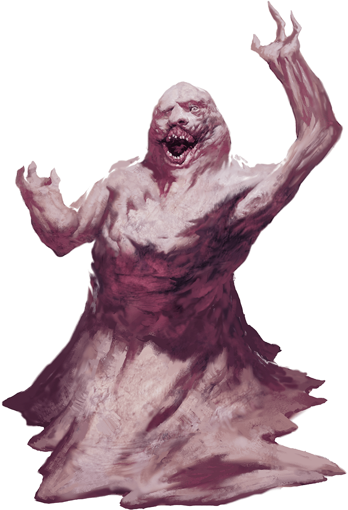

# Lemure

Armor Class
7

Hit Points
13
(3d8)

Speed
15 ft.

STR

10
(+0)

DEX

5
(-3)

CON

11
(+0)

INT

1
(-5)

WIS

11
(+0)

CHA

3
(-4)

Damage Resistances
Cold

Damage Immunities
Fire, Poison

Condition Immunities
Charmed, Frightened, Poisoned

Senses
Darkvision 120 ft., Passive Perception 10

Languages
Understands Infernal but can't speak it

Challenge
0 (10 XP)

Proficiency Bonus
+2

## Traits

* **Devil's Sight.** Magical darkness doesn't impede the lemure's darkvision.

* **Hellish Rejuvenation.** A lemure that dies in the Nine Hells comes back to life with all its hit points in 1d10 days unless it is killed by a good-aligned creature with a bless spell cast on that creature or its remains are sprinkled with holy water.

## Actions

* **Fist.** *Melee Weapon Attack:* +3 to hit, reach 5 ft., one target.

*Hit:*2 (1d4) bludgeoning damage.