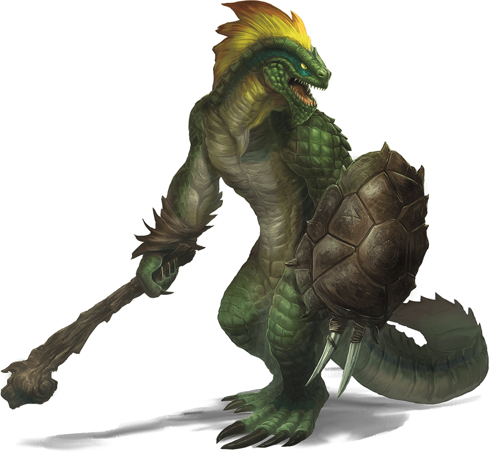

# Lizardfolk

## Traits

* **Hold Breath.** The lizardfolk can hold its breath for 15 minutes.

## Actions

* **Multiattack.** The lizardfolk makes two melee attacks, each one with a different weapon.

* **Bite.** *Melee Weapon Attack:* +4 to hit, reach 5 ft., one target.

*Hit:*5 (1d6 + 2) piercing damage.

* **Heavy Club.** *Melee Weapon Attack:* +4 to hit, reach 5 ft., one target.

*Hit:*5 (1d6 + 2) bludgeoning damage.

* **Javelin.** *Melee or Ranged Weapon Attack:* +4 to hit, reach 5 ft. or range 30/120 ft., one target.

*Hit:*5 (1d6 + 2) piercing damage.

* **Spiked Shield.** *Melee Weapon Attack:* +4 to hit, reach 5 ft., one target.

*Hit:*5 (1d6 + 2) piercing damage.

### Description

Lizardfolk are primitive reptilian humanoids that lurk in swamps and jungles. Fiercely territorial, they kill when it is expedient and do whatever it takes to survive.