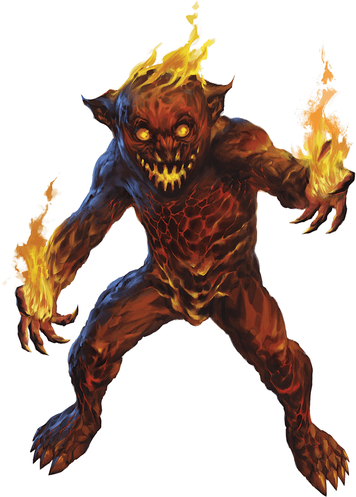

# Magmin

## Traits

* **Death Burst.** When the magmin dies, it explodes in a burst of fire and magma. Each creature within 10 feet of it must make a DC 11 Dexterity saving throw, taking 7 (2d6) fire damage on a failed save, or half as much damage on a successful one. Flammable objects that aren't being worn or carried in that area are ignited.

* **Ignited Illumination.** As a bonus action, the magmin can set itself ablaze or extinguish its flames. While ablaze, the magmin sheds bright light in a 10-foot radius and dim light for an additional 10 feet.

## Actions

* **Touch.** *Melee Weapon Attack:* +4 to hit, reach 5 ft., one target.

*Hit:*7 (2d6) fire damage. If the target is a creature or a flammable object, it ignites. Until a creature takes an action to douse the fire, the target takes 3 (1d6) fire damage at the end of each of its turns.