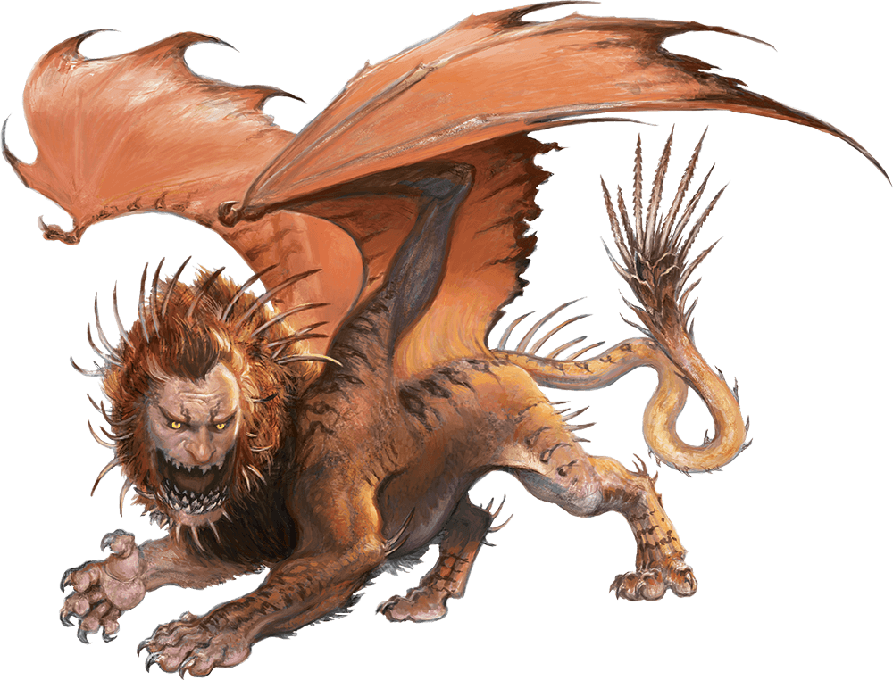

# Manticore

Armor Class
14
(natural armor)

Hit Points
68
(8d10 + 24)

Speed
30 ft., fly 50 ft.

STR

17
(+3)

DEX

16
(+3)

CON

17
(+3)

INT

7
(-2)

WIS

12
(+1)

CHA

8
(-1)

Senses
Darkvision 60 ft., Passive Perception 11

Languages
Common

Challenge
3 (700 XP)

Proficiency Bonus
+2

## Traits

* **Tail Spike Regrowth.** The manticore has twenty-four tail spikes. Used spikes regrow when the manticore finishes a long rest.

## Actions

* **Multiattack.** The manticore makes three attacks: one with its bite and two with its claws or three with its tail spikes.

* **Bite.** *Melee Weapon Attack:* +5 to hit, reach 5 ft., one target.

*Hit:*7 (1d8 + 3) piercing damage.

* **Claw.** *Melee Weapon Attack:* +5 to hit, reach 5 ft., one target.

*Hit:*6 (1d6 + 3) slashing damage.

* **Tail Spike.** *Ranged Weapon Attack:* +5 to hit, range 100/200 ft., one target.

*Hit:*7 (1d8 + 3) piercing damage.

### Description

A manticore has a vaguely humanoid head, the body of a lion, and the wings of a dragon. Its long tail ends in a cluster of deadly spikes that can impale prey at impressive range.