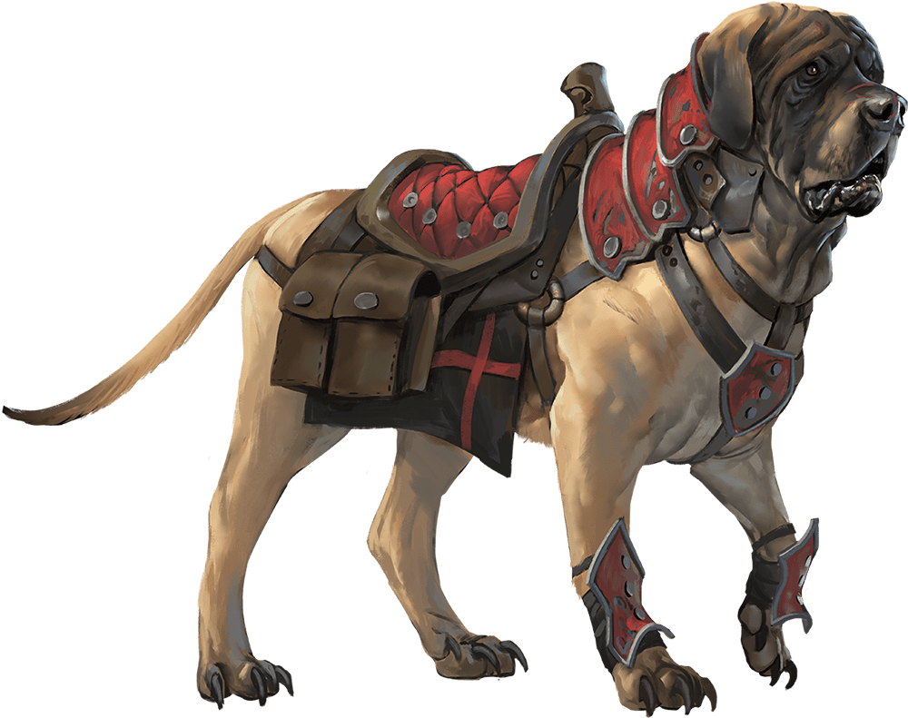

# Mastiff

Armor Class
12

Hit Points
5
(1d8 + 1)

Speed
40 ft.

STR

13
(+1)

DEX

14
(+2)

CON

12
(+1)

INT

3
(-4)

WIS

12
(+1)

CHA

7
(-2)

Skills
Perception +5

Senses
Darkvision 60 ft., Passive Perception 15

Languages
None

Challenge
1/8 (25 XP)

Proficiency Bonus
+2

## Actions

* **Bite.** *Melee Attack Roll:* +3, reach 5 ft.

*Hit:*4 (1d6 + 1) Piercing damage, and the target has the Prone condition if it is Large or smaller.