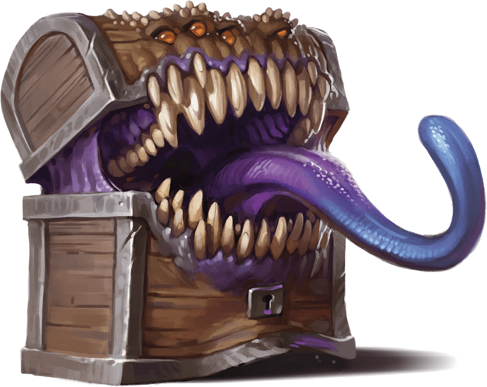

# Mimic

## Traits

* **Shapechanger.** The mimic can use its action to polymorph into an object or back into its true, amorphous form. Its statistics are the same in each form. Any equipment it is wearing or carrying isn't transformed. It reverts to its true form if it dies.

* **Adhesive (Object Form Only).** The mimic adheres to anything that touches it. A Huge or smaller creature adhered to the mimic is also grappled by it (escape DC 13). Ability checks made to escape this grapple have disadvantage.

* **False Appearance (Object Form Only).** While the mimic remains motionless, it is indistinguishable from an ordinary object.

* **Grappler.** The mimic has advantage on attack rolls against any creature grappled by it.

## Actions

* **Pseudopod.** *Melee Weapon Attack:* +5 to hit, reach 5 ft., one target.

*Hit:*7 (1d8 + 3) bludgeoning damage. If the mimic is in object form, the target is subjected to its Adhesive trait.

* **Bite.** *Melee Weapon Attack:* +5 to hit, reach 5 ft., one target.

*Hit:*7 (1d8 + 3) piercing damage plus 4 (1d8) acid damage.