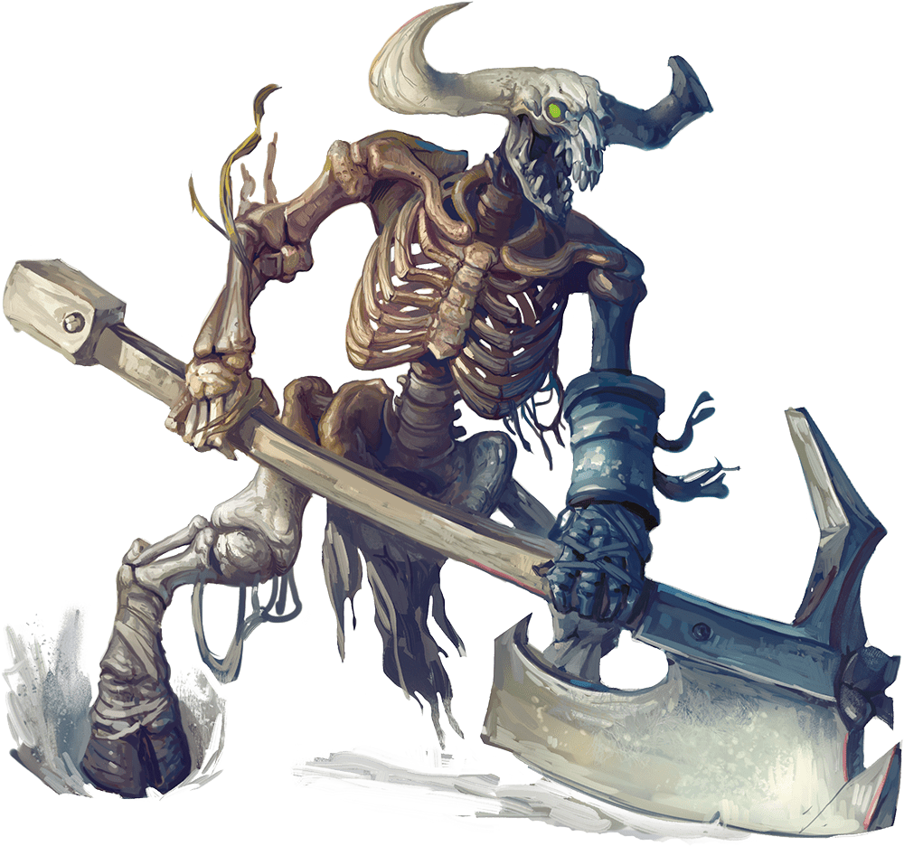

# Minotaur Skeleton

Armor Class
12
(natural armor)

Hit Points
67
(9d10 + 18)

Speed
40 ft.

STR

18
(+4)

DEX

11
(+0)

CON

15
(+2)

INT

6
(-2)

WIS

8
(-1)

CHA

5
(-3)

Damage Vulnerabilities
Bludgeoning

Damage Immunities
Poison

Condition Immunities
Exhaustion, Poisoned

Senses
Darkvision 60 ft., Passive Perception 9

Languages
Understands Abyssal but can't speak it

Challenge
2 (450 XP)

Proficiency Bonus
+2

## Traits

* **Charge.** If the skeleton moves at least 10 feet straight toward a target and then hits it with a gore attack on the same turn, the target takes an extra 9 (2d8) piercing damage. If the target is a creature, it must succeed on a DC 14 Strength saving throw or be pushed up to 10 feet away and knocked prone.

## Actions

* **Greataxe.** *Melee Weapon Attack:* +6 to hit, reach 5 ft., one target.

*Hit:*17 (2d12 + 4) slashing damage.

* **Gore.** *Melee Weapon Attack:* +6 to hit, reach 5 ft., one target.

*Hit:*13 (2d8 + 4) piercing damage.