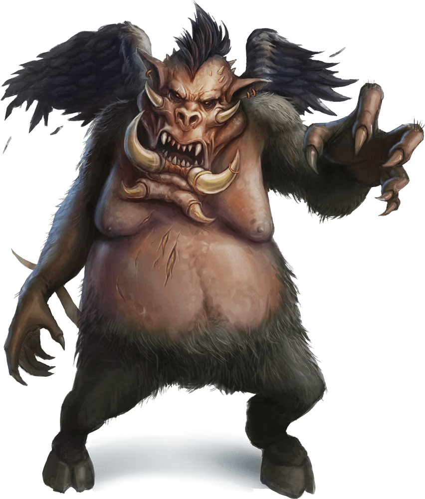

# Nalfeshnee

## Traits

* **Magic Resistance.** The nalfeshnee has advantage on saving throws against spells and other magical effects.

## Actions

* **Multiattack.** The nalfeshnee uses Horror Nimbus if it can. It then makes three attacks: one with its bite and two with its claws.

* **Bite.** *Melee Weapon Attack:* +10 to hit, reach 5 ft., one target.

*Hit:*32 (5d10 + 5) piercing damage.

* **Claw.** *Melee Weapon Attack:* +10 to hit, reach 10 ft., one target.

*Hit:*15 (3d6 + 5) slashing damage.

* **Horror Nimbus (Recharge 5–6).** The nalfeshnee magically emits scintillating, multicolored light. Each creature within 15 feet of the nalfeshnee that can see the light must succeed on a DC 15 Wisdom saving throw or be frightened for 1 minute. A creature can repeat the saving throw at the end of each of its turns, ending the effect on itself on a success. If a creature's saving throw is successful or the effect ends for it, the creature is immune to the nalfeshnee's Horror Nimbus for the next 24 hours.

* **Teleport.** The nalfeshnee magically teleports, along with any equipment it is wearing or carrying, up to 120 feet to an unoccupied space it can see.