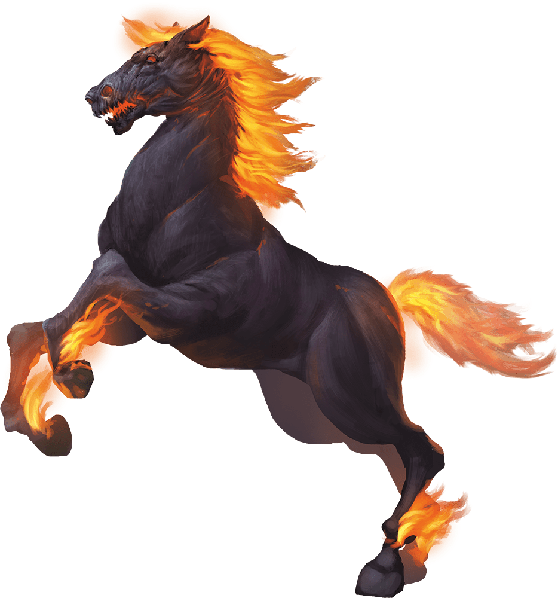

# Nightmare

Armor Class
13
(natural armor)

Hit Points
68
(8d10 + 24)

Speed
60 ft., fly 90 ft.

STR

18
(+4)

DEX

15
(+2)

CON

16
(+3)

INT

10
(+0)

WIS

13
(+1)

CHA

15
(+2)

Damage Immunities
Fire

Senses
Passive Perception 11

Languages
Common and Infernal but can't speak

Challenge
3 (700 XP)

Proficiency Bonus
+2

## Traits

* **Confer Fire Resistance.** The nightmare can grant resistance to fire damage to anyone riding it.

* **Illumination.** The nightmare sheds bright light in a 10-foot radius and dim light for an additional 10 feet.

## Actions

* **Hooves.** *Melee Weapon Attack:* +6 to hit, reach 5 ft., one target.

*Hit:*13 (2d8 + 4) bludgeoning damage plus 7 (2d6) fire damage.

* **Ethereal Stride.** The nightmare and up to three willing creatures within 5 feet of it magically enter the Ethereal Plane from the Material Plane, or vice versa.