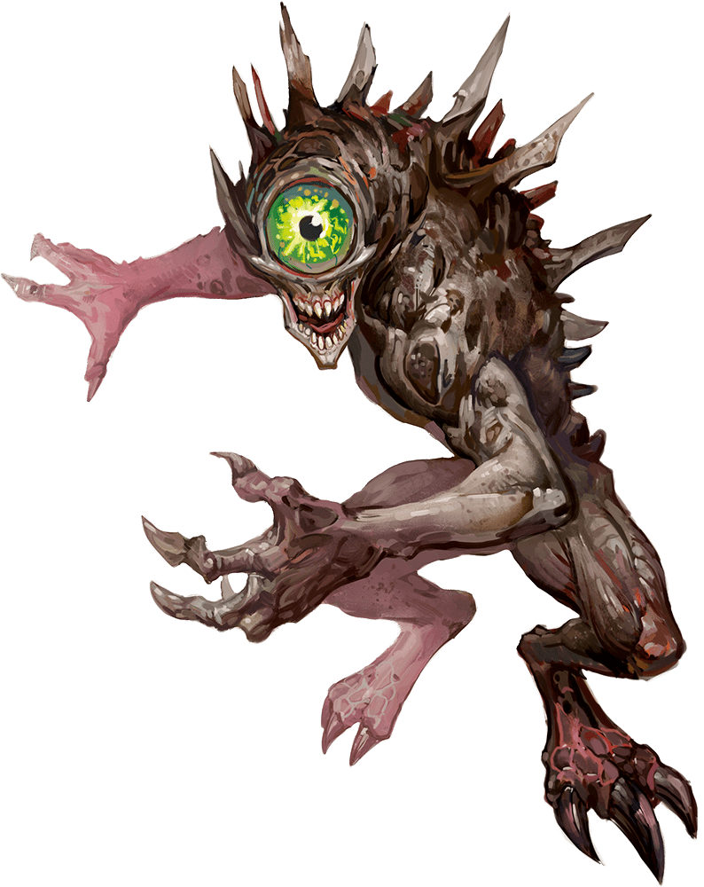

# Nothic

## Traits

* **Keen Sight.** The nothic has advantage on Wisdom (Perception) checks that rely on sight.

## Actions

* **Multiattack.** The nothic makes two claw attacks.

* **Claw.** *Melee Weapon Attack:* +4 to hit, reach 5 ft., one target.

*Hit:*6 (1d6 + 3) slashing damage.

* **Rotting Gaze.** The nothic targets one creature it can see within 30 feet of it. The target must succeed on a DC 12 Constitution saving throw against this magic or take 10 (3d6) necrotic damage.

* **Weird Insight.** The nothic targets one creature it can see within 30 feet of it. The target must contest its Charisma (Deception) check against the nothic’s Wisdom (Insight) check. If the nothic wins, it magically learns one fact or secret about the target. The target automatically wins if it is immune to being charmed.

### Description

A nothic is a monstrous creature with terrible talons and a single great eye. When driven to violence, it uses its horrific gaze to rot the flesh from its enemies’ bones.