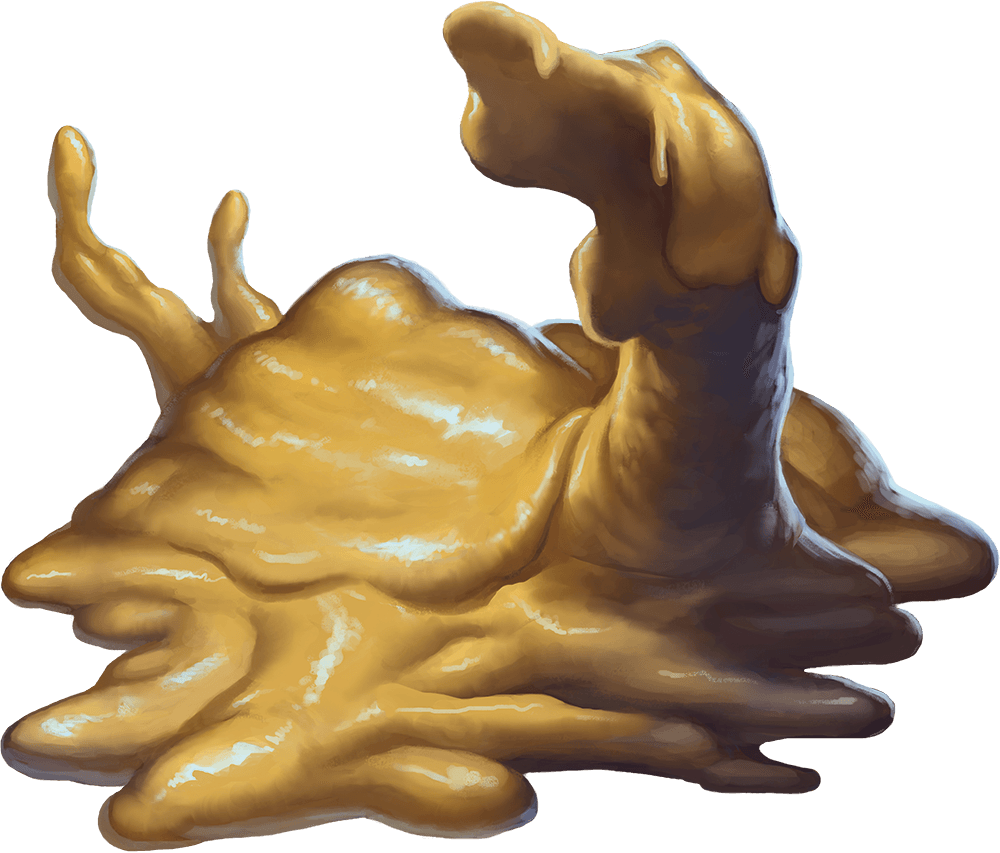

# Ochre Jelly

## Traits

* **Amorphous.** The jelly can move through a space as narrow as 1 inch wide without squeezing.

* **Spider Climb.** The jelly can climb difficult surfaces, including upside down on ceilings, without needing to make an ability check.

## Actions

* **Pseudopod.** *Melee Weapon Attack:* +4 to hit, reach 5 ft., one target.

*Hit:*9 (2d6 + 2) bludgeoning damage plus 3 (1d6) acid damage.

## Reactions

* **Split.** When a jelly that is Medium or larger is subjected to lightning or slashing damage, it splits into two new jellies if it has at least 10 hit points. Each new jelly has hit points equal to half the original jelly's, rounded down. New jellies are one size smaller than the original jelly.

### Description

An ochre jelly is a yellowish ooze that can slide under doors and through narrow cracks in pursuit of creatures to devour.