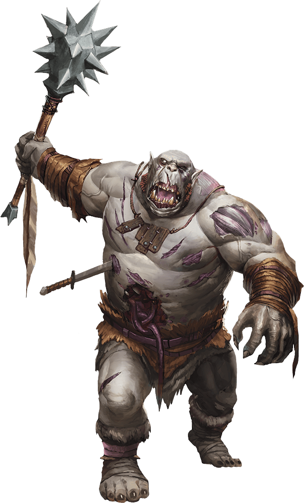

# Ogre Zombie

Armor Class
8

Hit Points
85
(9d10 + 36)

Speed
30 ft.

STR

19
(+4)

DEX

6
(-2)

CON

18
(+4)

INT

3
(-4)

WIS

6
(-2)

CHA

5
(-3)

Saving Throws
WIS +0

Damage Immunities
Poison

Condition Immunities
Poisoned

Senses
Darkvision 60 ft., Passive Perception 8

Languages
Understands Common and Giant but can't speak

Challenge
2 (450 XP)

Proficiency Bonus
+2

## Traits

* **Undead Fortitude.** If damage reduces the zombie to 0 hit points, it must make a Constitution saving throw with a DC of 5 + the damage taken, unless the damage is radiant or from a critical hit. On a success, the zombie drops to 1 hit point instead.

## Actions

* **Morningstar.** *Melee Weapon Attack:* +6 to hit, reach 5 ft., one target.

*Hit:*13 (2d8 + 4) bludgeoning damage.