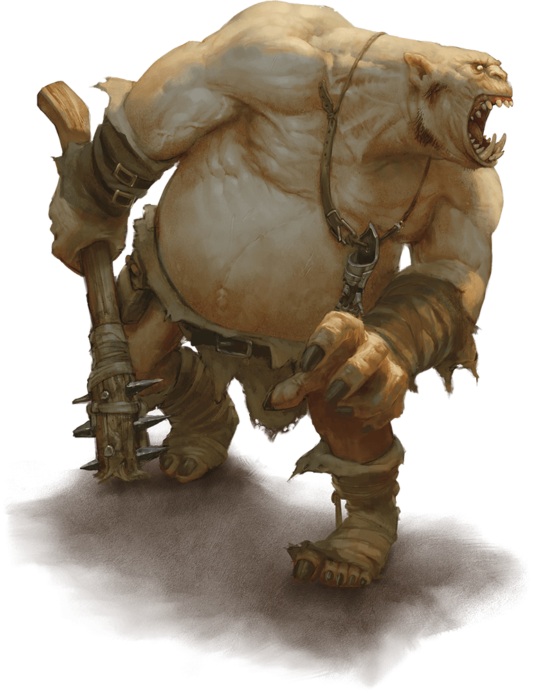

# Ogre

Armor Class
11
(hide armor)

Hit Points
59
(7d10 + 21)

Speed
40 ft.

STR

19
(+4)

DEX

8
(-1)

CON

16
(+3)

INT

5
(-3)

WIS

7
(-2)

CHA

7
(-2)

Senses
Darkvision 60 ft., Passive Perception 8

Languages
Common, Giant

Challenge
2 (450 XP)

Proficiency Bonus
+2

## Actions

* **Greatclub.** *Melee Weapon Attack:* +6 to hit, reach 5 ft., one target.

*Hit:*13 (2d8 + 4) bludgeoning damage.

* **Javelin.** *Melee or Ranged Weapon Attack:* +6 to hit, reach 5 ft. or range 30/120 ft., one target.

*Hit:*11 (2d6 + 4) piercing damage.

### Description

Ogres are hulking giants notorious for their quick tempers. When its rage is incited, an ogre lashes out in a frustrated tantrum until it runs out of objects or creatures to smash.