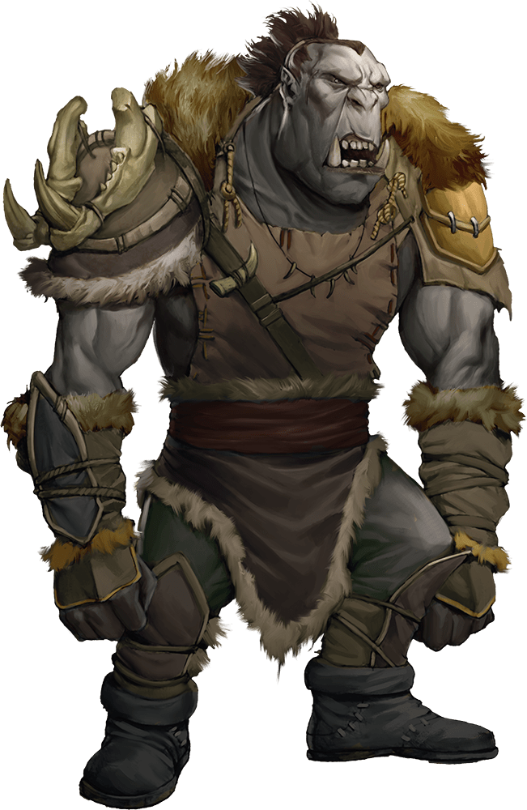

# Orc

Armor Class
13
(hide armor)

Hit Points
15
(2d8 + 6)

Speed
30 ft.

STR

16
(+3)

DEX

12
(+1)

CON

16
(+3)

INT

7
(-2)

WIS

11
(+0)

CHA

10
(+0)

Skills
Intimidation +2

Senses
Darkvision 60 ft., Passive Perception 10

Languages
Common, Orc

Challenge
1/2 (100 XP)

Proficiency Bonus
+2

## Traits

* Aggressive*. As a bonus action, the orc can move up to its speed toward a hostile creature that it can see.

## Actions

* **Greataxe.** *Melee Weapon Attack:* +5 to hit, reach 5 ft., one target.

*Hit:*9 (1d12 + 3) slashing damage.

* **Javelin.** *Melee or Ranged Weapon Attack:* +5 to hit, reach 5 ft. or range 30/120 ft., one target.

*Hit:*6 (1d6 + 3) piercing damage.

### Description

Orcs are burly raiders with prominent lower canines that resemble tusks. They gather in tribes that satisfy their bloodlust by slaying any humanoids that stand against them.