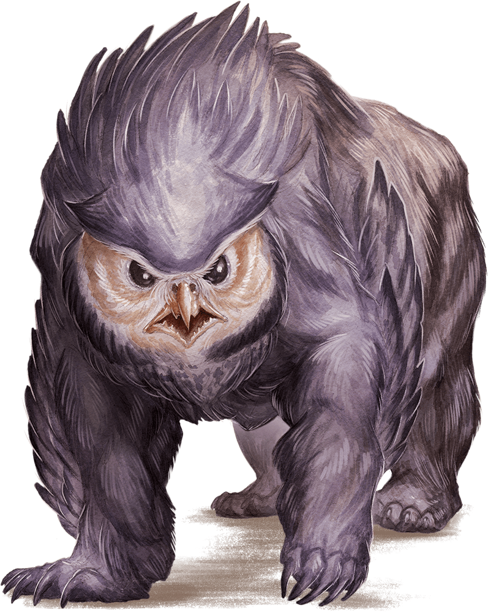

# Owlbear

Armor Class
13
(natural armor)

Hit Points
59
(7d10 + 21)

Speed
40 ft.

STR

20
(+5)

DEX

12
(+1)

CON

17
(+3)

INT

3
(-4)

WIS

12
(+1)

CHA

7
(-2)

Skills
Perception +3

Senses
Darkvision 60 ft., Passive Perception 13

Languages
--

Challenge
3 (700 XP)

Proficiency Bonus
+2

## Traits

* **Keen Sight and Smell.** The owlbear has advantage on Wisdom (Perception) checks that rely on sight or smell.

## Actions

* **Multiattack.** The owlbear makes two attacks: one with its beak and one with its claws.

* **Beak.** *Melee Weapon Attack:* +7 to hit, reach 5 ft., one creature.

*Hit:*10 (1d10 + 5) piercing damage.

* **Claws.** *Melee Weapon Attack:* +7 to hit, reach 5 ft., one target.

*Hit:*14 (2d8 + 5) slashing damage.

### Description

A monstrous cross between giant owl and bear, an owlbear’s reputation for ferocity and aggression makes it one of the most feared predators of the wild.