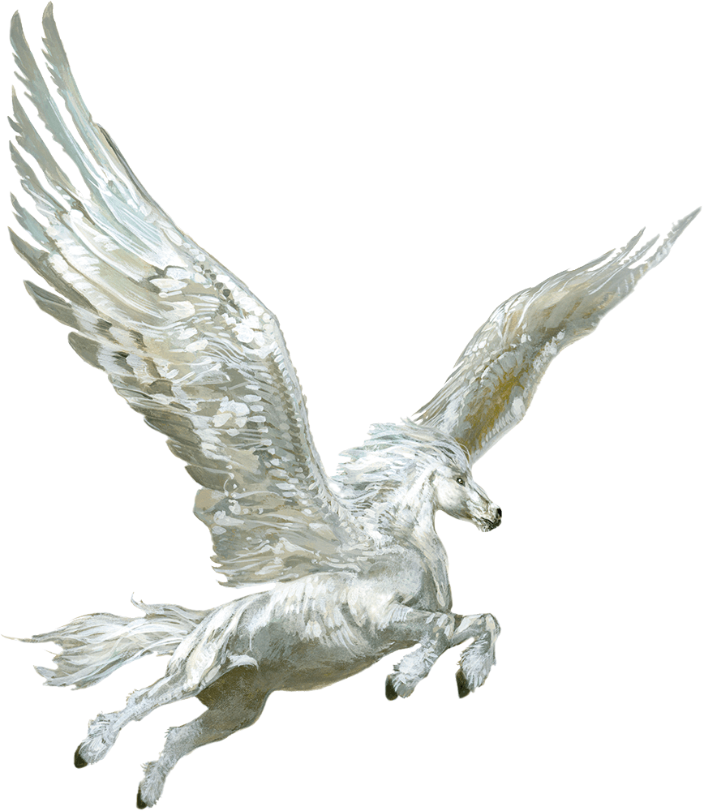

# Pegasus

Armor Class
12

Hit Points
59
(7d10 + 21)

Speed
60 ft., fly 90 ft.

STR

18
(+4)

DEX

15
(+2)

CON

16
(+3)

INT

10
(+0)

WIS

15
(+2)

CHA

13
(+1)

Saving Throws
DEX +4, WIS +4, CHA +3

Skills
Perception +6

Senses
Passive Perception 16

Languages
Celestial, Common, Elvish and Sylvan but can't speak

Challenge
2 (450 XP)

Proficiency Bonus
+2

## Actions

* **Hooves.** *Melee Weapon Attack:* +6 to hit, reach 5 ft., one target.

*Hit:*11 (2d6 + 4) bludgeoning damage.

### Description

The white winged horses known as pegasi soar through the skies, a vision of grace and majesty.