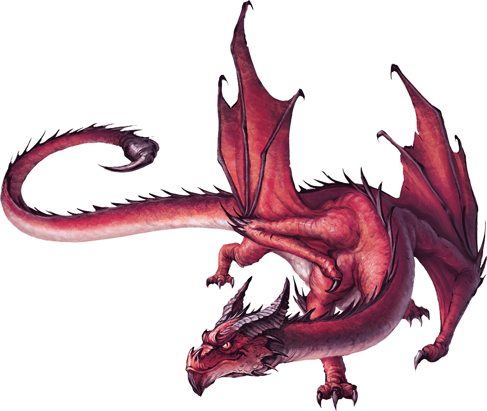

# Pseudodragon

Armor Class
14

Hit Points
10
(3d4 + 3)

Speed
15 ft., fly 60 ft.

STR

6
(-2)

DEX

15
(+2)

CON

13
(+1)

INT

10
(+0)

WIS

12
(+1)

CHA

10
(+0)

Skills
Perception +5, Stealth +4

Senses
Blindsight 10 ft., Darkvision 60 ft., Passive Perception 15

Languages
Understands Common and Draconic but can’t speak

Challenge
1/4 (50 XP)

Proficiency Bonus
+2

## Traits

* **Magic Resistance.** The pseudodragon has Advantage on saving throws against spells and other magical effects.

## Actions

* **Multiattack.** The pseudodragon makes two Bite attacks.

* **Bite.** *Melee Attack Roll:* +4, reach 5 ft.

*Hit:*4 (1d4 + 2) Piercing damage.

* **Sting.** *Constitution Saving Throw:* DC 12, one creature the pseudodragon can see within 5 feet.

*Failure:*5 (2d4) Poison damage, and the target has the Poisoned condition for 1 hour.

*Failure by 5 or More:*The Poisoned target also has the Unconscious condition until it takes damage or another creature takes an action to shake it awake.