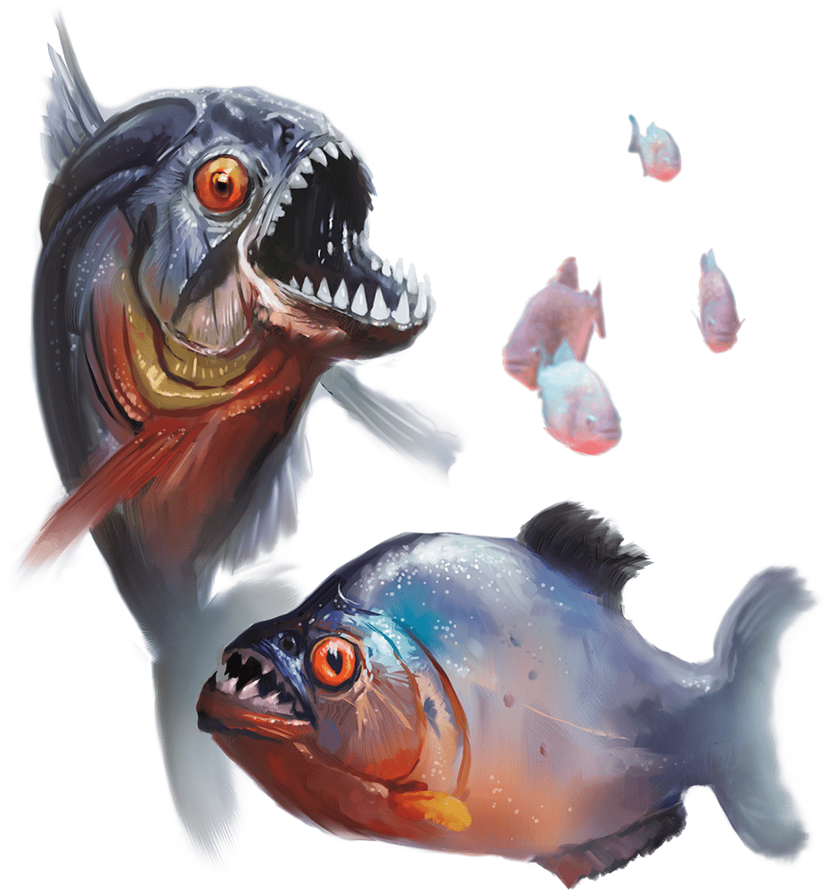

# Quipper

Armor Class
13

Hit Points
1
(1d4 - 1)

Speed
0 ft., swim 40 ft.

STR

2
(-4)

DEX

16
(+3)

CON

9
(-1)

INT

1
(-5)

WIS

7
(-2)

CHA

2
(-4)

Senses
Darkvision 60 ft., Passive Perception 8

Languages
--

Challenge
0 (10 XP)

Proficiency Bonus
+2

## Traits

* **Blood Frenzy.** The quipper has advantage on melee attack rolls against any creature that doesn't have all its hit points.

* **Water Breathing.** The quipper can breathe only underwater.

## Actions

* **Bite.** *Melee Weapon Attack:* +5 to hit, reach 5 ft., one target.

*Hit:*1 piercing damage.

### Description

A quipper is a carnivorous fish with sharp teeth. Quippers can adapt to any aquatic environment, including cold subterranean lakes. They frequently gather in swarms; the statistics for a swarm of quippers appear later in this appendix.