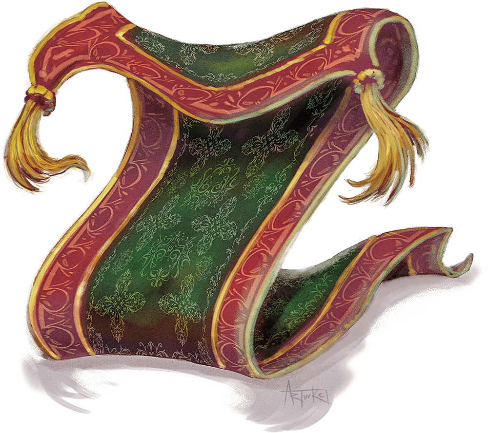

# Rug of Smothering

## Traits

* **Antimagic Susceptibility.** The rug is incapacitated while in the area of an antimagic field. If targeted by dispel magic, the rug must succeed on a Constitution saving throw against the caster's spell save DC or fall unconscious for 1 minute.

* **Damage Transfer.** While it is grappling a creature, the rug takes only half the damage dealt to it, and the creature grappled by the rug takes the other half.

* **False Appearance.** While the rug remains motionless, it is indistinguishable from a normal rug.

## Actions

* **Smother.** *Melee Weapon Attack:* +5 to hit, reach 5 ft., one Medium or smaller creature.

*Hit:*The creature is grappled (escape DC 13). Until this grapple ends, the target is restrained, blinded, and at risk of suffocating, and the rug can't smother another target. In addition, at the start of each of the target's turns, the target takes 10 (2d6 + 3) bludgeoning damage.