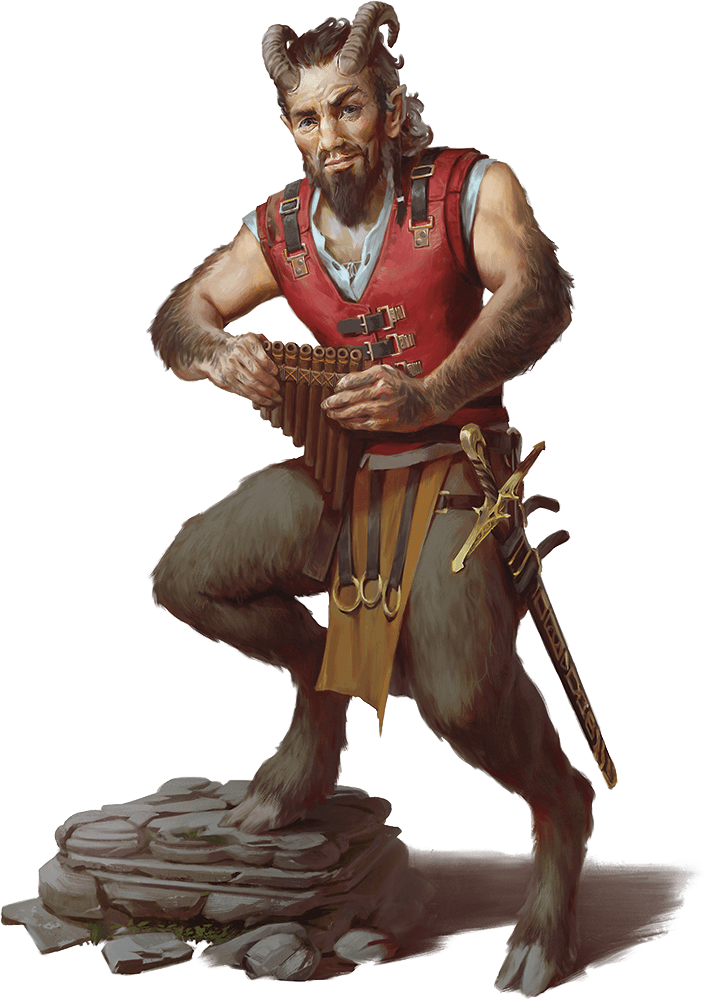

# Satyr

Armor Class
14
(leather armor)

Hit Points
31
(7d8)

Speed
40 ft.

STR

12
(+1)

DEX

16
(+3)

CON

11
(+0)

INT

12
(+1)

WIS

10
(+0)

CHA

14
(+2)

Skills
Perception +2, Performance +6, Stealth +5

Senses
Passive Perception 12

Languages
Common, Elvish, Sylvan

Challenge
1/2 (100 XP)

Proficiency Bonus
+2

## Traits

* **Magic Resistance.** The satyr has advantage on saving throws against spells and other magical effects.

## Actions

* **Ram.** *Melee Weapon Attack:* +3 to hit, reach 5 ft., one target.

*Hit:*6 (2d4 + 1) bludgeoning damage.

* **Shortsword.** *Melee Weapon Attack:* +5 to hit, reach 5 ft., one target.

*Hit:*6 (1d6 + 3) piercing damage.

* **Shortbow.** *Ranged Weapon Attack:* +5 to hit, range 80/320 ft., one target.

*Hit:*6 (1d6 + 3) piercing damage.

### Description

Satyrs are raucous fey that resemble stout male humans with the furry lower bodies and cloven hooves of goats. They frolic in wild forests, driven by curiosity and hedonism in equal measure.