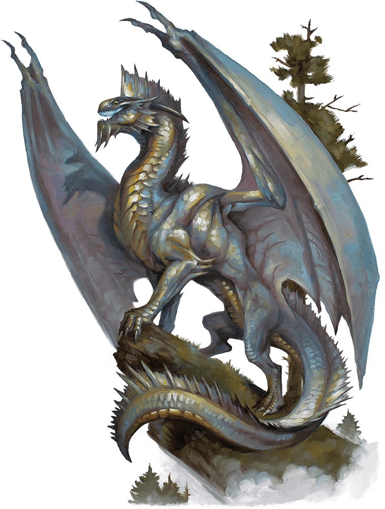

# Silver Dragon Wyrmling

Armor Class
17
(natural armor)

Hit Points
45
(6d8 + 18)

Speed
30 ft., fly 60 ft.

STR

19
(+4)

DEX

10
(+0)

CON

17
(+3)

INT

12
(+1)

WIS

11
(+0)

CHA

15
(+2)

Saving Throws
DEX +2, CON +5, WIS +2, CHA +4

Skills
Perception +4, Stealth +2

Damage Immunities
Cold

Senses
Blindsight 10 ft., Darkvision 60 ft., Passive Perception 14

Languages
Draconic

Challenge
2 (450 XP)

Proficiency Bonus
+2

## Actions

* **Bite.** *Melee Weapon Attack:* +6 to hit, reach 5 ft., one target.

*Hit:*9 (1d10 + 4) piercing damage.

* **Breath Weapons (Recharge 5–6).** The dragon uses one of the following breath weapons.

**Cold Breath.** The dragon exhales an icy blast in a 15-foot cone. Each creature in that area must make a DC 13 Constitution saving throw, taking 18 (4d8) cold damage on a failed save, or half as much damage on a successful one.

**Paralyzing Breath.** The dragon exhales paralyzing gas in a 15-foot cone. Each creature in that area must succeed on a DC 13 Constitution saving throw or be paralyzed for 1 minute. A creature can repeat the saving throw at the end of each of its turns, ending the effect on itself on a success.