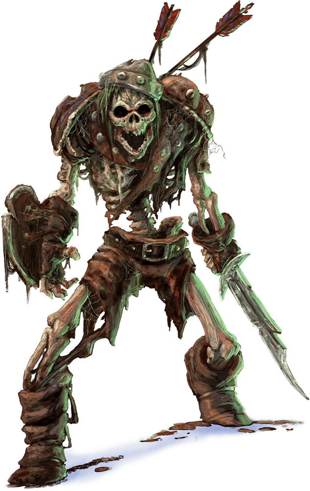

# Skeleton

Armor Class
13

Hit Points
13
(2d8 + 4)

Speed
30 ft.

STR

10
(+0)

DEX

16
(+3)

CON

15
(+2)

INT

6
(-2)

WIS

8
(-1)

CHA

5
(-3)

Damage Vulnerabilities
Bludgeoning

Damage Immunities
Poison

Condition Immunities
Exhaustion, Poisoned

Gear
Shortbow, Shortsword

Senses
Darkvision 60 ft., Passive Perception 9

Languages
Understands the languages it knew in life but can't speak

Challenge
1/4 (50 XP)

Proficiency Bonus
+2

## Actions

* **Shortsword.** *Melee Attack Roll:* +5, reach 5 ft.

*Hit:*6 (1d6 + 3) Piercing damage.

* **Shortbow.** *Ranged Attack Roll:* +5, range 80/320 ft.

*Hit:*6 (1d6 + 3) Piercing damage.