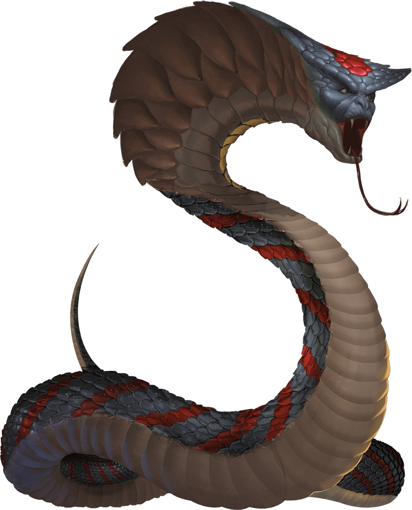

# Spirit Naga

## Traits

* **Rejuvenation.** If it dies, the naga returns to life in 1d6 days and regains all its hit points. Only a wish spell can prevent this trait from functioning.

* **Spellcasting.** The naga is a 10th-level spellcaster. Its spellcasting ability is Intelligence (spell save DC 14, +6 to hit with spell attacks), and it needs only verbal components to cast its spells. It has the following wizard spells prepared:

Cantrips (at will): mage hand, minor illusion, ray of frost

1st level (4 slots): charm person, detect magic, sleep

2nd level (3 slots): detect thoughts, hold person

3rd level (3 slots): lightning bolt, water breathing

4th level (3 slots): blight, dimension door

5th level (2 slots): dominate person

## Actions

* **Bite.** *Melee Weapon Attack:* +7 to hit, reach 10 ft., one creature.

*Hit:*7 (1d6 + 4) piercing damage, and the target must make a DC 13 Constitution saving throw, taking 31 (7d8) poison damage on a failed save, or half as much damage on a successful one.