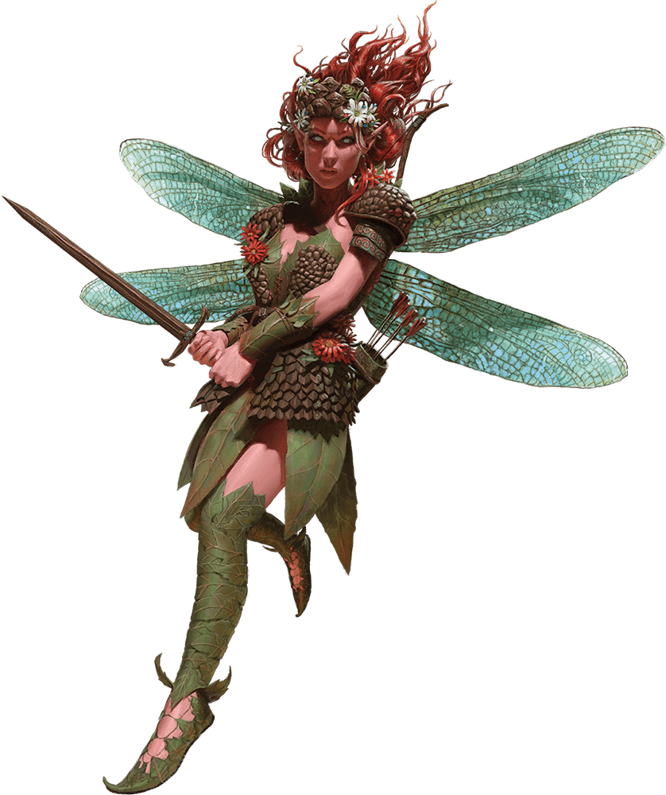

# Sprite

Armor Class
15

Hit Points
10
(4d4)

Speed
10 ft., fly 40 ft.

STR

3
(-4)

DEX

18
(+4)

CON

10
(+0)

INT

14
(+2)

WIS

13
(+1)

CHA

11
(+0)

Skills
Perception +3, Stealth +8

Senses
Passive Perception 13

Languages
Common, Elvish, Sylvan

Challenge
1/4 (50 XP)

Proficiency Bonus
+2

## Actions

* **Needle Sword.** *Melee Attack Roll:* +6, reach 5 ft.

*Hit:*6 (1d4 + 4) Piercing damage.

* **Enchanting Bow.** *Ranged Attack Roll:* +6, range 40/160 ft.

*Hit:*1 Piercing damage, and the target has the Charmed condition until the start of the sprite’s next turn.

* **Heart Sight.** *Charisma Saving Throw:* DC 10, one creature within 5 feet the sprite can see. Celestials, Fiends, and Undead automatically fail the save.

*Failure:*The sprite knows the target’s emotions and alignment.

* **Invisibility.** The sprite casts Invisibility on itself, requiring no spell components and using Charisma as the spellcasting ability.