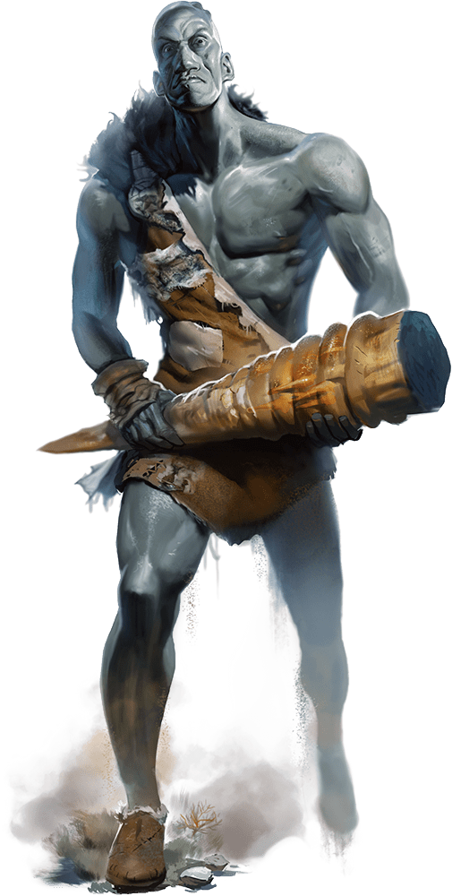

# Stone Giant

Armor Class
17
(natural armor)

Hit Points
126
(11d12 + 55)

Speed
40 ft.

STR

23
(+6)

DEX

15
(+2)

CON

20
(+5)

INT

10
(+0)

WIS

12
(+1)

CHA

9
(-1)

Saving Throws
DEX +5, CON +8, WIS +4

Skills
Athletics +12, Perception +4

Senses
Darkvision 60 ft., Passive Perception 14

Languages
Giant

Challenge
7 (2,900 XP)

Proficiency Bonus
+3

## Traits

* **Stone Camouflage.** The giant has advantage on Dexterity (Stealth) checks made to hide in rocky terrain.

## Actions

* **Multiattack.** The giant makes two greatclub attacks.

* **Greatclub.** *Melee Weapon Attack:* +9 to hit, reach 15 ft., one target.

*Hit:*19 (3d8 + 6) bludgeoning damage.

* **Rock.** *Ranged Weapon Attack:* +9 to hit, range 60/240 ft., one target.

*Hit:*28 (4d10 + 6) bludgeoning damage. If the target is a creature, it must succeed on a DC 17 Strength saving throw or be knocked prone.

## Reactions

* **Rock Catching.** If a rock or similar object is hurled at the giant, the giant can, with a successful DC 10 Dexterity saving throw, catch the missile and take no bludgeoning damage from it.