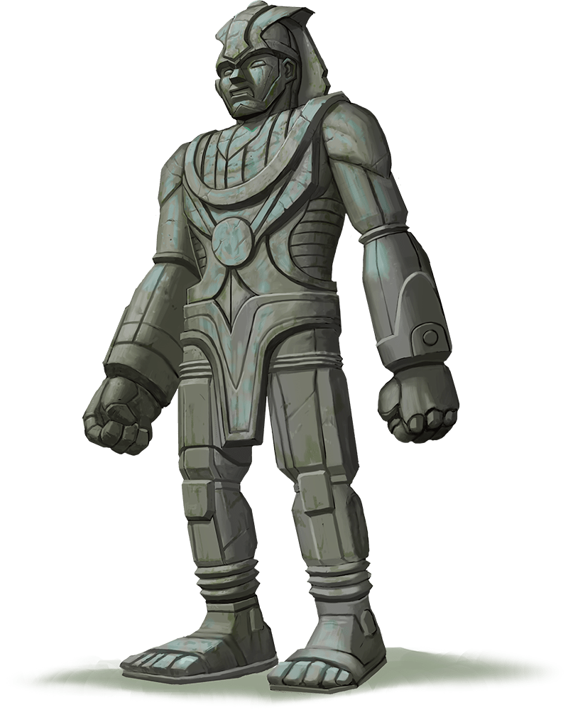

# Stone Golem

## Traits

* **Immutable Form.** The golem is immune to any spell or effect that would alter its form.

* **Magic Resistance.** The golem has advantage on saving throws against spells and other magical effects.

* **Magic Weapons.** The golem's weapon attacks are magical.

## Actions

* **Multiattack.** The golem makes two slam attacks.

* **Slam.** *Melee Weapon Attack:* +10 to hit, reach 5 ft., one target.

*Hit:*19 (3d8 + 6) bludgeoning damage.

* **Slow (Recharge 5–6).** The golem targets one or more creatures it can see within 10 feet of it. Each target must make a DC 17 Wisdom saving throw against this magic. On a failed save, a target can't use reactions, its speed is halved, and it can't make more than one attack on its turn. In addition, the target can take either an action or a bonus action on its turn, not both. These effects last for 1 minute. A target can repeat the saving throw at the end of each of its turns, ending the effect on itself on a success.

### Description

Stone golems are magical constructs cut and chiseled from stone to appear as tall, impressive statues. Like other golems, they are nearly impervious to spells and ordinary weapons.