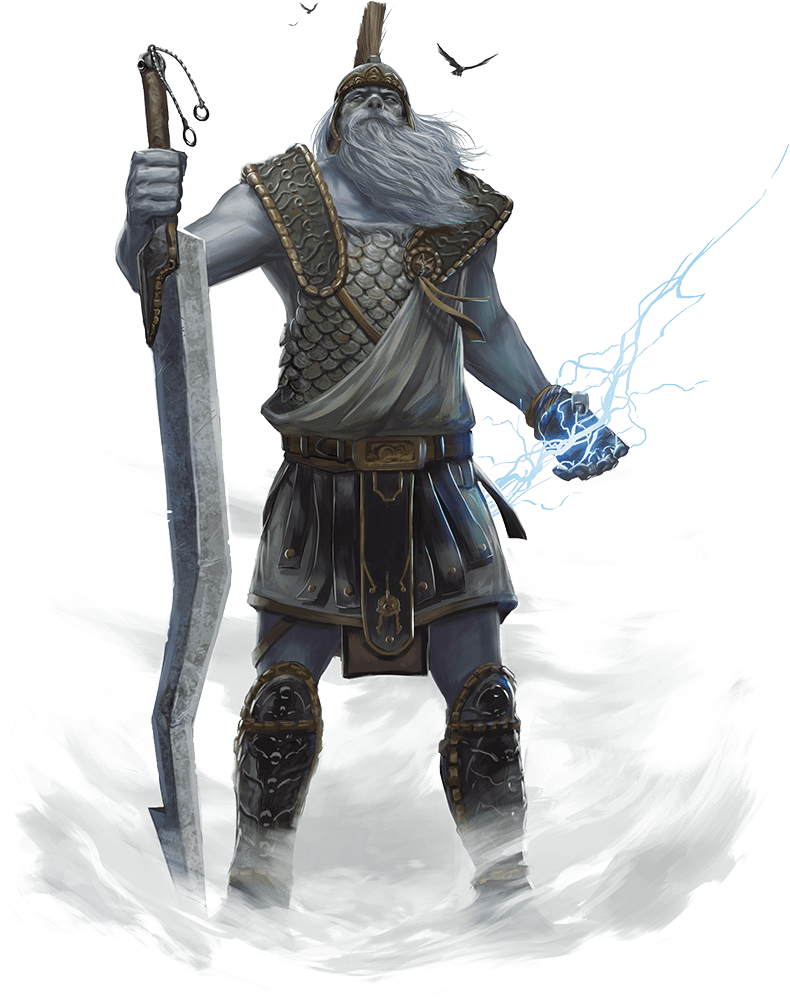

# Storm Giant

## Traits

* **Amphibious.** The giant can breathe air and water.

## Actions

* **Multiattack.** The giant makes two Greatsword attacks.

* **Greatsword.** *Melee Weapon Attack:* +14 to hit, reach 10 ft., one target.

*Hit:*30 (6d6 + 9) slashing damage.

* **Rock.** *Ranged Weapon Attack:* +14 to hit, range 60/240 ft., one target.

*Hit:*35 (4d12 + 9) bludgeoning damage.

* **Lightning Strike (Recharge 5–6).** The giant hurls a magical lightning bolt at a point it can see within 500 feet of it. Each creature within 10 feet of that point must make a DC 17 Dexterity saving throw, taking 54 (12d8) lightning damage on a failed save, or half as much damage on a successful one.

** Spellcasting.** The giant casts one of the following spells, requiring no material spell components and using Charisma as the spellcasting ability (spell save DC 17):

At will: detect magic, levitate, light

1/day each: control weather (cast as 1 action), water breathing