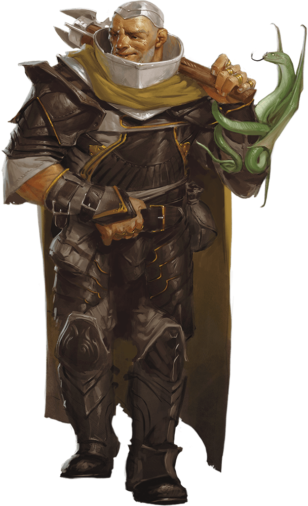

# Thug

Armor Class
11
(leather armor)

Hit Points
32
(5d8 + 10)

Speed
30 ft.

STR

15
(+2)

DEX

11
(+0)

CON

14
(+2)

INT

10
(+0)

WIS

10
(+0)

CHA

11
(+0)

Skills
Intimidation +2

Senses
Passive Perception 10

Languages
Any one language (usually Common)

Challenge
1/2 (100 XP)

Proficiency Bonus
+2

## Traits

* **Pack Tactics.** The thug has advantage on an attack roll against a creature if at least one of the thug's allies is within 5 feet of the creature and the ally isn't incapacitated.

## Actions

* **Multiattack.** The thug makes two melee attacks.

* **Mace.** *Melee Weapon Attack:* +4 to hit, reach 5 ft., one creature.

*Hit:*5 (1d6 + 2) bludgeoning damage.

* **Heavy Crossbow.** *Ranged Weapon Attack:* +2 to hit, range 100/400 ft., one target.

*Hit:*5 (1d10) piercing damage.

### Description

Thugs are ruthless enforcers skilled at intimidation and violence. They work for money and have few scruples.