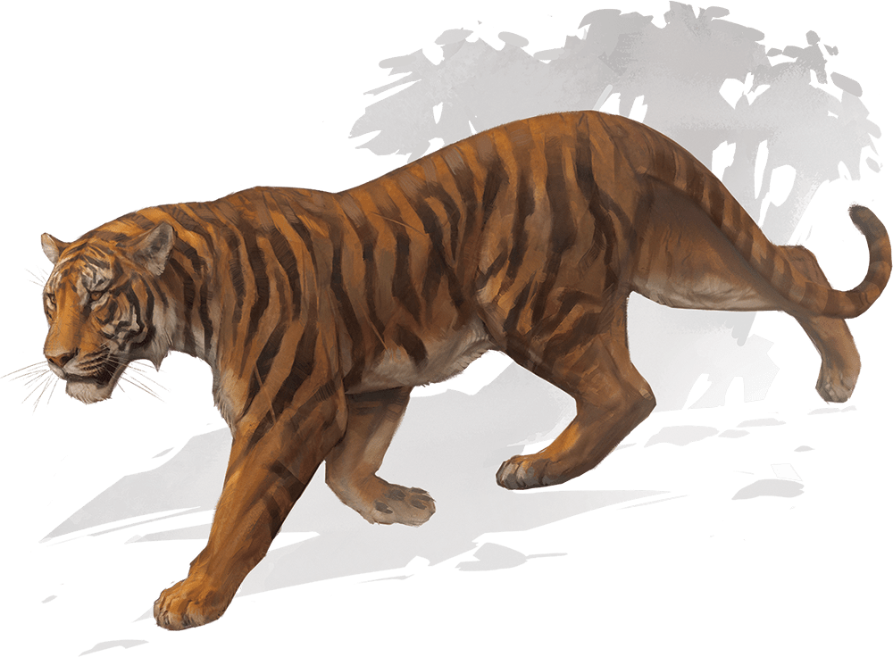

# Tiger

Armor Class
13

Hit Points
22
(3d10 + 6)

Speed
40 ft.

STR

17
(+3)

DEX

16
(+3)

CON

14
(+2)

INT

3
(-4)

WIS

12
(+1)

CHA

8
(-1)

Skills
Perception +3, Stealth +7

Senses
Darkvision 60 ft., Passive Perception 13

Languages
None

Challenge
1 (200 XP)

Proficiency Bonus
+2

## Actions

* **Multiattack.** The tiger makes one Pounce attack and uses Prowl.

* **Pounce.** *Melee Attack Roll:* +5, reach 5 ft.

*Hit:*6 (1d6 + 3) Slashing damage. If the tiger had Advantage on the attack roll, the target takes an extra 3 (1d6) Slashing damage and, if it is Huge or smaller, has the Prone condition.

* **Prowl.** The tiger moves up to half its Speed without provoking Opportunity Attacks. At the end of this movement, the tiger can take the Hide action.