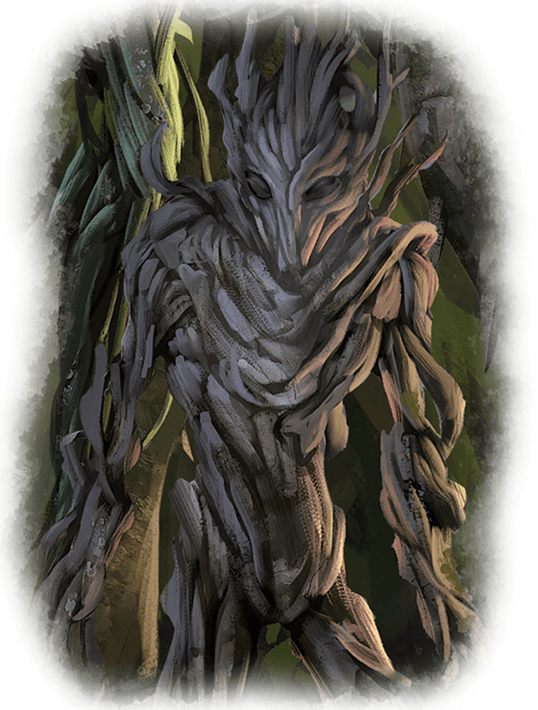

# Twig Blight

Armor Class
13
natural armor

Hit Points
4
(1d6 + 1)

Speed
20 ft.

STR

6
(-2)

DEX

13
(+1)

CON

12
(+1)

INT

4
(-3)

WIS

8
(-1)

CHA

3
(-4)

Skills
Stealth +3

Damage Vulnerabilities
Fire

Senses
Blindsight 60 ft. (blind beyond this radius), Passive Perception 9

Languages
understands Common but can’t speak

Challenge
1/8 (25 XP)

Proficiency Bonus
+2

## Traits

* **False Appearance.** While the blight remains motionless, it is indistinguishable from a dead shrub.

## Actions

* **Claws.** *Melee Weapon Attack:* +3 to hit, reach 5 ft., one target.

*Hit:*3 (1d4 + 1) piercing damage.

### Description

A twig blight is an awakened plant that resembles a woody shrub that can pull its roots free of the ground. Its branches twist together to form a humanoid-looking body with a head and limbs.