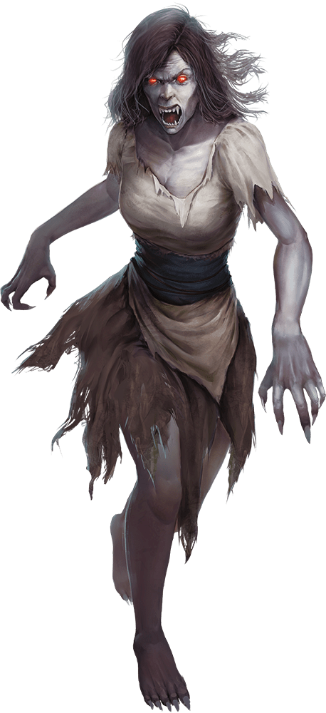

# Vampire Spawn

## Traits

* **Regeneration.** The vampire regains 10 hit points at the start of its turn if it has at least 1 hit point and isn't in sunlight or running water. If the vampire takes radiant damage or damage from holy water, this trait doesn't function at the start of the vampire's next turn.

* **Spider Climb.** The vampire can climb difficult surfaces, including upside down on ceilings, without needing to make an ability check.

* **Vampire Weaknesses.** The vampire has the following flaws:

*Forbiddance.* The vampire can't enter a residence without an invitation from one of the occupants.

*Harmed by Running Water.* The vampire takes 20 acid damage when it ends its turn in running water.

*Stake to the Heart.* The vampire is destroyed if a piercing weapon made of wood is driven into its heart while it is incapacitated in its resting place.

*Sunlight Hypersensitivity.* The vampire takes 20 radiant damage when it starts its turn in sunlight. While in sunlight, it has disadvantage on attack rolls and ability checks.

## Actions

* **Multiattack.** The vampire makes two attacks, only one of which can be a bite attack.

* **Claws.** *Melee Weapon Attack:* +6 to hit, reach 5 ft., one creature.

*Hit:*8 (2d4 + 3) slashing damage. Instead of dealing damage, the vampire can grapple the target (escape DC 13).

* **Bite.** *Melee Weapon Attack:* +6 to hit, reach 5 ft., one willing creature, or a creature that is grappled by the vampire, incapacitated, or restrained.

*Hit:*6 (1d6 + 3) piercing damage plus 7 (2d6) necrotic damage. The target's hit point maximum is reduced by an amount equal to the necrotic damage taken, and the vampire regains hit points equal to that amount. The reduction lasts until the target finishes a long rest. The target dies if this effect reduces its hit point maximum to 0.

### A Vampire’s Lair

A vampire chooses a grand yet defensible location for its lair, such as a castle, fortified manor, or walled abbey. It hides its coffin in an underground crypt or vault guarded by vampire spawn or other loyal creatures of the night.

#### Regional Effects

The region surrounding a vampire’s lair is warped by the creature’s unnatural presence, creating any of the following effects:

- There’s a noticeable increase in the populations of bats, rats, and wolves in the region.
- Plants within 500 feet of the lair wither, and their stems and branches become twisted and thorny.
- Shadows cast within 500 feet of the lair seem abnormally gaunt and sometimes move as though alive.
- A creeping fog clings to the ground within 500 feet of the vampire’s lair. The fog occasionally takes eerie forms, such as grasping claws and writhing serpents.

If the vampire is destroyed, these effects end after 2d6 days.