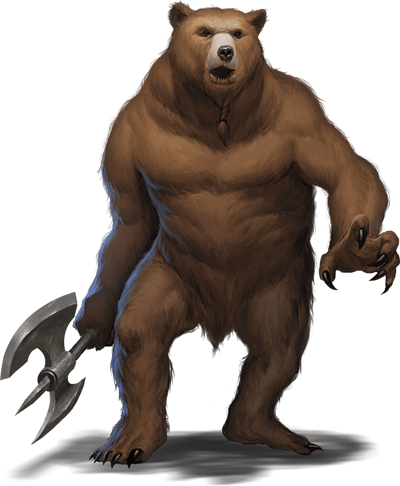

# Werebear

## Traits

* **Shapechanger.** The werebear can use its action to polymorph into a Large bear-humanoid hybrid or into a Large bear, or back into its true form, which is humanoid. Its statistics, other than its size and AC, are the same in each form. Any equipment it is wearing or carrying isn't transformed. It reverts to its true form if it dies.

* **Keen Smell.** The werebear has advantage on Wisdom (Perception) checks that rely on smell.

## Actions

* **Multiattack.** In bear form, the werebear makes two claw attacks. In humanoid form, it makes two greataxe attacks. In hybrid form, it can attack like a bear or a humanoid.

* **Bite (Bear or Hybrid Form Only).** *Melee Weapon Attack:* +7 to hit, reach 5 ft., one target.

*Hit:*15 (2d10 + 4) piercing damage. If the target is a humanoid, it must succeed on a DC 14 Constitution saving throw or be cursed with werebear lycanthropy.

* **Claw (Bear or Hybrid Form Only).** *Melee Weapon Attack:* +7 to hit, reach 5 ft., one target.

*Hit:*13 (2d8 + 4) slashing damage.

* **Greataxe (Humanoid or Hybrid Form Only).** *Melee Weapon Attack:* +7 to hit, reach 5 ft., one target.

*Hit:*10 (1d12 + 4) slashing damage.