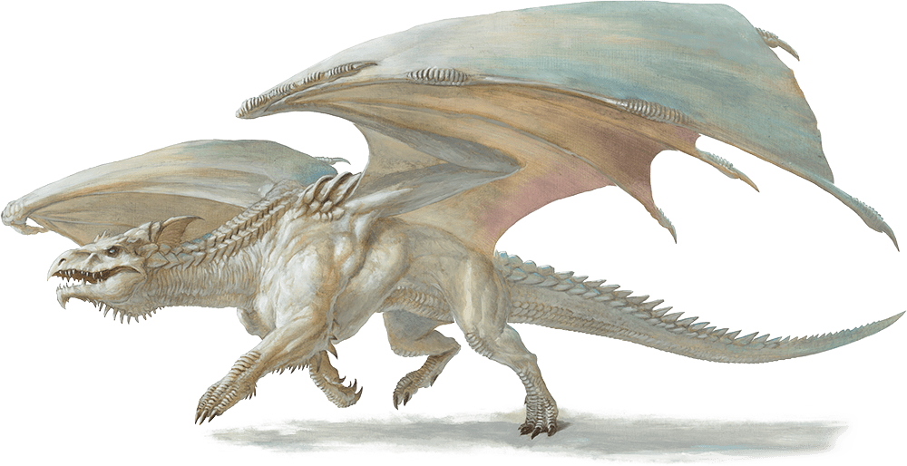

# White Dragon Wyrmling

Armor Class
16
(natural armor)

Hit Points
32
(5d8 + 10)

Speed
30 ft., burrow 15 ft., fly 60 ft., swim 30 ft.

STR

14
(+2)

DEX

10
(+0)

CON

14
(+2)

INT

5
(-3)

WIS

10
(+0)

CHA

11
(+0)

Saving Throws
DEX +2, CON +4, WIS +2, CHA +2

Skills
Perception +4, Stealth +2

Damage Immunities
Cold

Senses
Blindsight 10 ft., Darkvision 60 ft., Passive Perception 14

Languages
Draconic

Challenge
2 (450 XP)

Proficiency Bonus
+2

## Actions

* **Bite.** *Melee Weapon Attack:* +4 to hit, reach 5 ft., one target.

*Hit:*7 (1d10 + 2) piercing damage plus 2 (1d4) cold damage.

* **Cold Breath (Recharge 5–6).** The dragon exhales an icy blast of hail in a 15-foot cone. Each creature in that area must make a DC 12 Constitution saving throw, taking 22 (5d8) cold damage on a failed save, or half as much damage on a successful one.