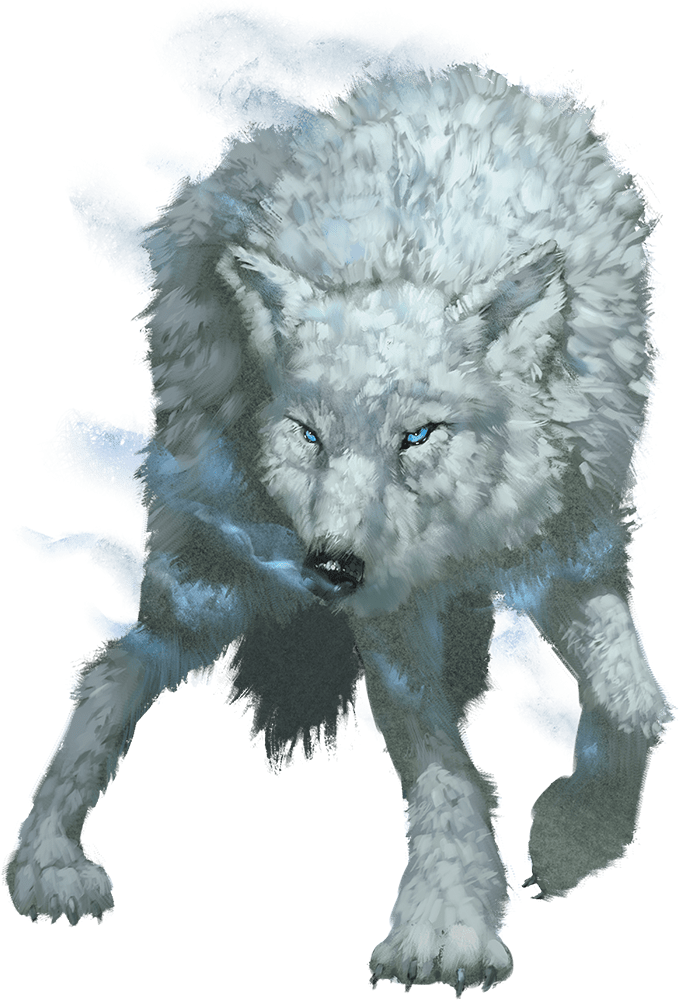

# Winter Wolf

## Traits

* **Keen Hearing and Smell.** The wolf has advantage on Wisdom (Perception) checks that rely on hearing or smell.

* **Pack Tactics.** The wolf has advantage on an attack roll against a creature if at least one of the wolf's allies is within 5 feet of the creature and the ally isn't incapacitated.

* **Snow Camouflage.** The wolf has advantage on Dexterity (Stealth) checks made to hide in snowy terrain.

## Actions

* **Bite.** *Melee Weapon Attack:* +6 to hit, reach 5 ft., one target.

*Hit:*11 (2d6 + 4) piercing damage. If the target is a creature, it must succeed on a DC 14 Strength saving throw or be knocked prone.

* **Cold Breath (Recharge 5–6).** The wolf exhales a blast of freezing wind in a 15-foot cone. Each creature in that area must make a DC 12 Dexterity saving throw, taking 18 (4d8) cold damage on a failed save, or half as much damage on a successful one.

### Description

The arctic-dwelling winter wolf is as large as a dire wolf but has snow-white fur and pale blue eyes. Frost giants use these evil creatures as guards and hunting companions, putting the wolves' deadly breath weapon to use against their foes. Winter wolves communicate with one another using growls and barks, but they speak Common and Giant well enough to follow simple conversations.