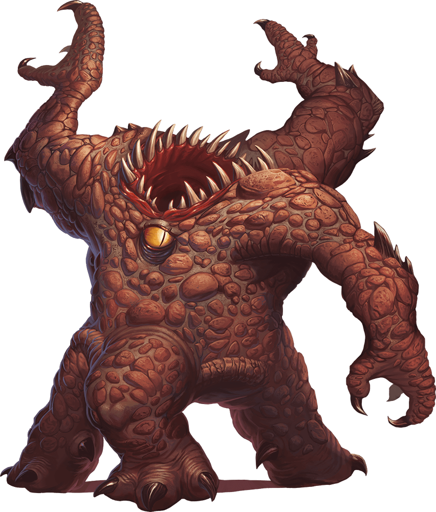

# Xorn

Armor Class
19
(natural armor)

Hit Points
73
(7d8 + 42)

Speed
20 ft., burrow 20 ft.

STR

17
(+3)

DEX

10
(+0)

CON

22
(+6)

INT

11
(+0)

WIS

10
(+0)

CHA

11
(+0)

Skills
Perception +6, Stealth +3

Damage Resistances
Piercing and Slashing from Nonmagical Attacks that aren't Adamantine

Senses
Darkvision 60 ft., Tremorsense 60 ft., Passive Perception 16

Languages
Terran

Challenge
5 (1,800 XP)

Proficiency Bonus
+3

## Traits

* **Earth Glide.** The xorn can burrow through nonmagical, unworked earth and stone. While doing so, the xorn doesn't disturb the material it moves through.

* **Stone Camouflage.** The xorn has advantage on Dexterity (Stealth) checks made to hide in rocky terrain.

* **Treasure Sense.** The xorn can pinpoint, by scent, the location of precious metals and stones, such as coins and gems, within 60 feet of it.

## Actions

* **Multiattack.** The xorn makes three claw attacks and one bite attack.

* **Claw.** *Melee Weapon Attack:* +6 to hit, reach 5 ft., one target.

*Hit:*6 (1d6 + 3) slashing damage.

* **Bite.** *Melee Weapon Attack:* +6 to hit, reach 5 ft., one target.

*Hit:*13 (3d6 + 3) piercing damage.