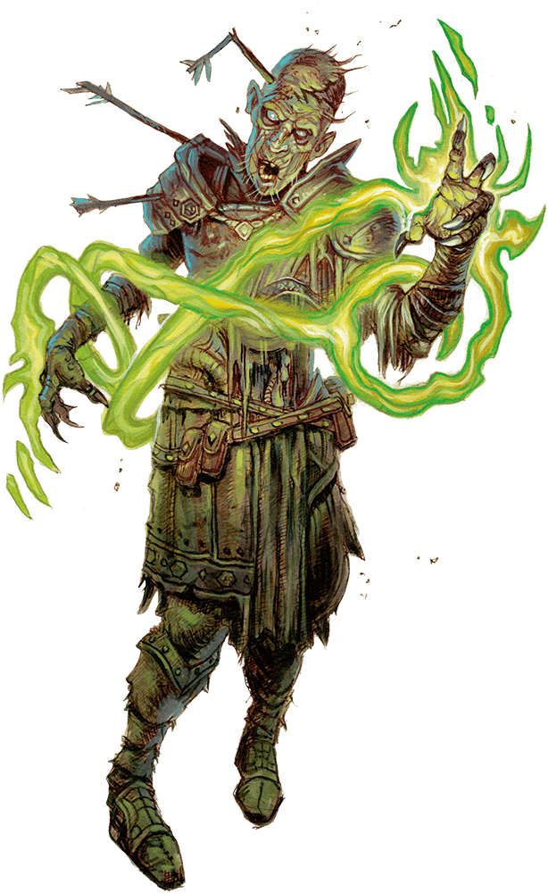

# Zombie

Armor Class
8

Hit Points
15
(2d8 + 6)

Speed
20 ft.

STR

13
(+1)

DEX

6
(-2)

CON

16
(+3)

INT

3
(-4)

WIS

6
(-2)

CHA

5
(-3)

Damage Immunities
Poison

Condition Immunities
Exhaustion, Poisoned

Senses
Darkvision 60 ft., Passive Perception 8

Languages
Understands the languages it knew in life but can't speak

Challenge
1/4 (50 XP)

Proficiency Bonus
+2

## Traits

* **Undead Fortitude.** If damage reduces the zombie to 0 Hit Points, it must make a Constitution saving throw with a DC of 5 plus the damage taken unless the damage is Radiant or from a Critical Hit. On a successful save, the zombie drops to 1 Hit Point instead.

## Actions

* **Slam.** *Melee Attack Roll:* +3, reach 5 ft.

*Hit:*4 (1d6 + 1) Bludgeoning damage.